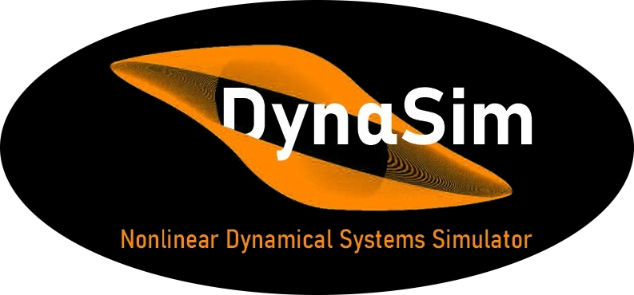
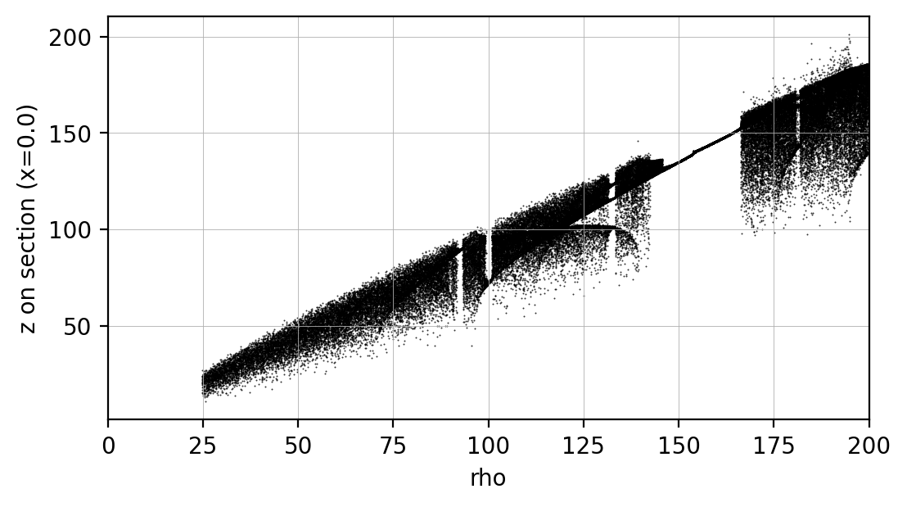
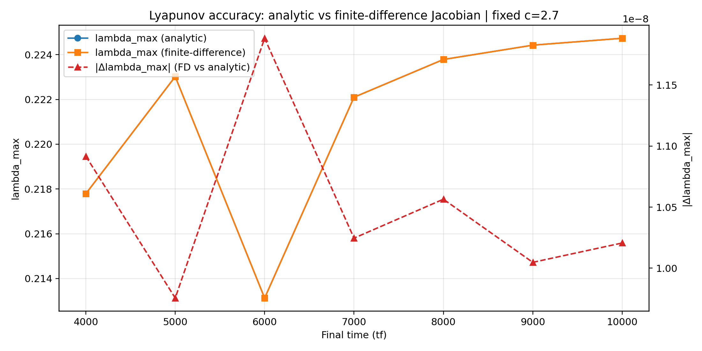
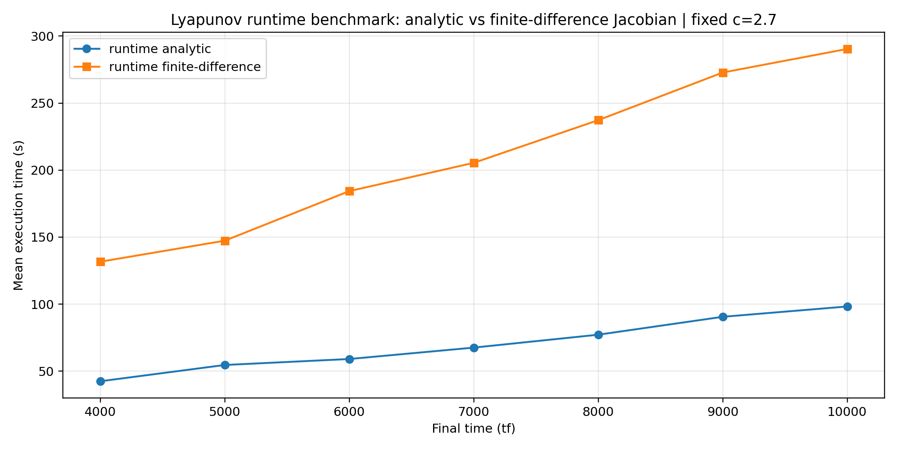
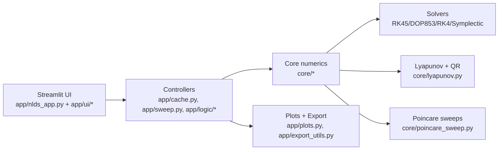

<div align="center">



# dynaSim (NLDS Simulator)

### Interactive Nonlinear Dynamics Laboratory for Simulation, Lyapunov Analysis, and Poincare Sweeps


</div>

dynaSim is a Streamlit-based platform for nonlinear dynamical systems.
It supports system simulation, Lyapunov spectrum estimation, and Poincare-driven parameter sweeps with continuation and optional local parallelism.

## Why This Project

- Make nonlinear dynamics workflows accessible from one interactive environment.
- Combine educational exploration with research-grade numerical pipelines.
- Keep the path from UI experiment to reproducible export straightforward.
- Accelerate heavy workloads through Numba-backed kernels where applicable.

## What dynaSim Includes

- **Systems:** Lorenz, Rossler, Henon-Heiles (Hamiltonian), and custom nD systems.
- **Solvers:** RK45, DOP853, fixed-step RK4, symplectic Forest-Ruth.
- **Lyapunov Spectrum:** variational equations + periodic QR; analytic/symbolic or finite-difference Jacobians.
- **Poincare Sections:** plane or expression-based definitions; crossing/slab detection modes.
- **Sweeps:** bifurcation (reset ICs) and continuation (warm-start), with optional local parallelism.
- **Sweep observables:** Poincare crossings or local extrema (max/min/both) in Tab 3.
- **Acceleration:** automatic Numba backend for fixed-step RK4, symplectic FR, and Lyapunov paths.
- **Axis controls:** explicit axis limits and optional square/equal-scale view for phase, bifurcation, and Lyapunov charts.
- **Cloud-safe execution:** bounded in-memory trajectory samples, plot decimation, and bounded sweep row retention.
- **Export:** trajectories, sweeps, and Lyapunov results to CSV, with chunked trajectory export for very large runs.
- **Manuals in App:** English and Greek HTML manuals from `docs/user-guide/`.

## Visual Snapshot

<div align="center">




</div>

<div align="center">



</div>

## Run Locally

```bash
streamlit run app/nlds_app.py
```

## Architecture (High Level)



## Ways To Use dynaSim

1. **Cloud (online)**
   - `https://nlds-simulator.streamlit.app`
   - `dynasim.streamlit.app`
   - Best for overview, teaching, and quick experiments without setup.

2. **Local Streamlit**
   - Recommended for heavier runs and to avoid cloud runtime limits.
   - Command:
   ```bash
   streamlit run app/nlds_app.py
   ```

3. **Jupyter Notebook A: trajectories / phase / Lyapunov / time series**
   - Use exported configs from Tab 4 and run deeper custom analysis.
   - Link: `NOTEBOOK_A_LINK_PENDING`

4. **Jupyter Notebook B: param sweeps / bifurcation / Lyapunov vs parameter**
   - Use exported sweep configs for batch and research workflows.
   - Link: `NOTEBOOK_B_LINK_PENDING`

Recommended workflow:
- Cloud for quick exploration.
- Local for unrestricted compute.
- Notebooks for research-grade parameterization and post-processing.

## Large Runs (Streamlit Cloud)

When running very large `tf/dt` combinations:

- Use `Max stored trajectory samples` in Tab 1 to cap trajectory memory.
- Use `Max points per plot` to decimate plotting data without changing integration horizon.
- Export long trajectories in chunks from Tab 4 (`Trajectory chunk size` + `Chunk number`).
- Keep in mind: memory is bounded, but very large runs can still hit CPU/time limits in cloud runtimes.

## Documentation Map

- User guide: `docs/user-guide/`
- Manuals (HTML):
  - English: `docs/user-guide/manual.html`
  - Greek: `docs/user-guide/manual-el.html`
- Theory notes: `docs/theory/`
- Developer docs: `docs/developer/`
- Greek quick guides: `docs/greek/`
- Docs index: `docs/README.md`

## Project Info

- Developed as part of the undergraduate thesis of **Odysseas Gkountinakos**.
- MSc Program in Computational Physics, Department of Physics, Aristotle University of Thessaloniki.
- Supervisor: **Christos Volos**.
- Source: `https://github.com/OdyGoundi/nds-simulator`
- Contact: `ody.gkount@gmail.com`

## License

This project is free software under the **GNU GPL v3.0**.

- License text: GNU GPL v3.0
- © 2026 Odysseas Gkountinakos
