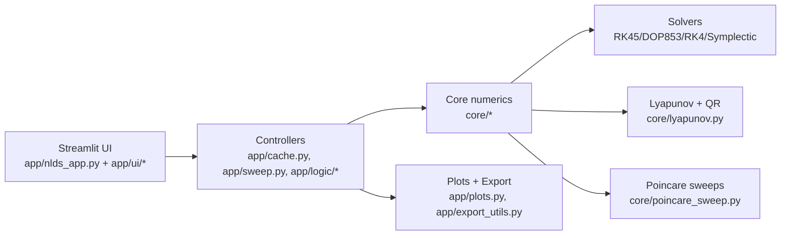

# NLDS Simulator

Streamlit app for nonlinear dynamics. It simulates Lorenz, Rossler, Henon-Heiles,
or custom nD systems; visualizes phase portraits and time series; computes
Lyapunov exponents; and generates Poincare-based bifurcation and Lyapunov sweeps
with continuation and optional local parallelism. A Numba backend accelerates
fixed-step RK4, Lyapunov, and symplectic integration.

---

## Architecture (high level)



---

## What the app includes

- Systems: Lorenz, Rossler, Henon-Heiles (Hamiltonian), custom nD.
- Solvers: RK45, DOP853, fixed-step RK4, symplectic Forest-Ruth.
- Lyapunov spectrum: variational equations + periodic QR; analytic/symbolic or FD Jacobians.
- Poincare sections: plane or expression-based sections; crossing or slab methods.
- Sweeps: bifurcation (reset ICs) and continuation (warm start), with optional local parallelism.
- Numba acceleration: auto-used for fixed-step RK4 and symplectic Forest-Ruth (and Lyapunov) when available.
- Export: trajectories, sweeps, and Lyapunov results (CSV).
- In-app manuals: Help (Eng) / Help(Ελλ) open HTML manuals in `docs/user-guide/`.

---

## Run

```bash
streamlit run app/nlds_app.py
```

---

## Info

- This application was developed as part of the undergraduate thesis of Odysseas Gkountinakos.
- MSc Program in Computational Physics, Department of Physics, Aristotle University of Thessaloniki.
- Supervisor: Christos Volos.
- Complete source code: https://github.com/OdyGoundi/nds-simulator
- Contact: ody.gkount@gmail.com

This application is distributed as free software. You are free to use, study, modify, and redistribute the source code under the terms of the GNU General Public License v3.0.

License text: GNU GPL v3.0

Licensed under the GNU GPL v3.0  
© 2026 Odysseas Gkountinakos

---

## Ways to use the app (4 modes)

1) Cloud (online)  
   dynasim.streamlit.app  
   Recommended for overview, educational use and quick experiments without installation. There may be runtime/resource limits (running time limits).

2) Local Streamlit  
   Recommended to avoid cloud runtime limitations and for heavy runs. After installing requirements (venv/conda), run:

   ```bash
   streamlit run app/nlds_app.py
   ```

3) Jupyter Notebook A — Phase portrait / Lyapunov / Time series  
   Notebook for generating trajectories, phase portraits, time series and computing Lyapunov exponents.  
   Link (pending): NOTEBOOK_A_LINK_PENDING

   Instruction: Save/export settings from Tab 4 (Export) and load the configs in the notebook.  
   Suitable for additional post-processing and custom analysis.

4) Jupyter Notebook B — Parametric sweeps / Bifurcation / Lyapunov vs parameter  
   Notebook for parametric sweeps, bifurcation diagrams (Poincare hits) and Lyapunov vs parameter.  
   Link (pending): NOTEBOOK_B_LINK_PENDING

   Instruction: Save/export sweep settings from Tab 4 (Export) and pass the configs to the notebook.  
   Recommended for full parameterization, batch runs and extra computational workflows.

Recommended use: Online for overview & educational purposes · Local for runs without cloud limits · Notebooks for full parameterization and “research-grade” pipelines.

---

## Docs

- User guide: `docs/user-guide/` (overview, phase portrait, time series, sweeps).
- Manuals (HTML): `docs/user-guide/manual.html` (English), `docs/user-guide/manual-el.html` (Greek).
- Theory notes: `docs/theory/` (numerical techniques, Poincare sections, bifurcation vs continuation).
- Developer: `docs/developer/` (architecture, sweep engine, session state, performance).
- Greek guides: `docs/greek/` (quick start, Tab 3).
- Docs index: `docs/README.md`.
