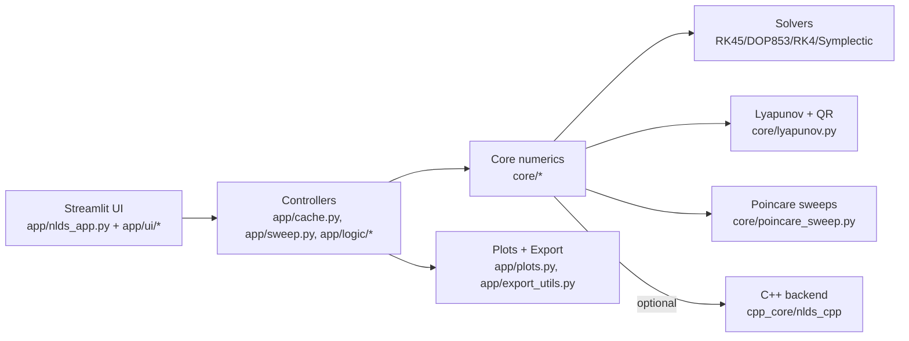

# NLDS Simulator

Streamlit app for nonlinear dynamics. It simulates Lorenz, Rossler, Henon-Heiles,
or custom nD systems; visualizes phase portraits and time series; computes
Lyapunov exponents; and generates Poincare-based bifurcation and Lyapunov sweeps
with continuation and optional local parallelism. An optional C++ backend
accelerates fixed-step RK4 and Lyapunov calculations.

---

## Architecture (high level)



---

## What the app includes

- Systems: Lorenz, Rossler, Henon-Heiles (Hamiltonian), custom nD.
- Solvers: RK45, DOP853, fixed-step RK4, symplectic Verlet, symplectic Forest-Ruth.
- Lyapunov spectrum: variational equations + periodic QR; analytic/symbolic or FD Jacobians.
- Poincare sections: plane or expression-based sections; crossing or slab methods.
- Sweeps: bifurcation (reset ICs) and continuation (warm start), with optional local parallelism.
- Export: trajectories, sweeps, and Lyapunov results (CSV).

---

## Run

```bash
streamlit run app/nlds_app.py
```

---

## Docs

- User guide: `docs/user-guide/` (overview, phase portrait, time series, sweeps).
- Theory notes: `docs/theory/` (numerical techniques, Poincare sections, bifurcation vs continuation).
- Developer: `docs/developer/` (architecture, sweep engine, session state, performance).
- C++ backend: `cpp_core/README.md`.
- Greek guides: `docs/greek/` (quick start, Tab 3).
- Docs index: `docs/README.md`.
