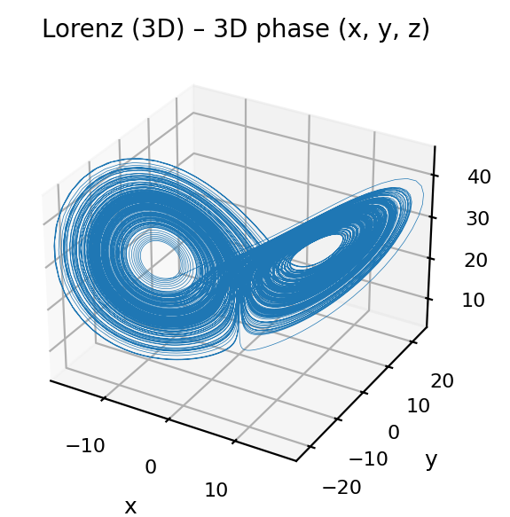
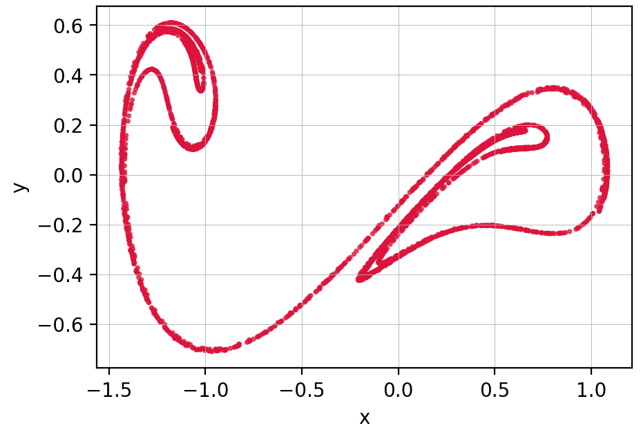
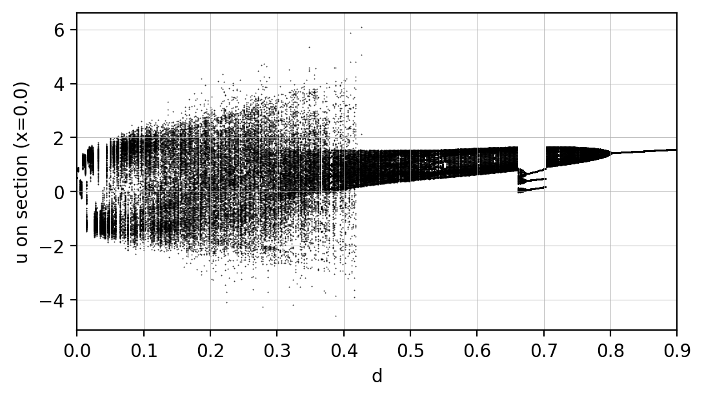
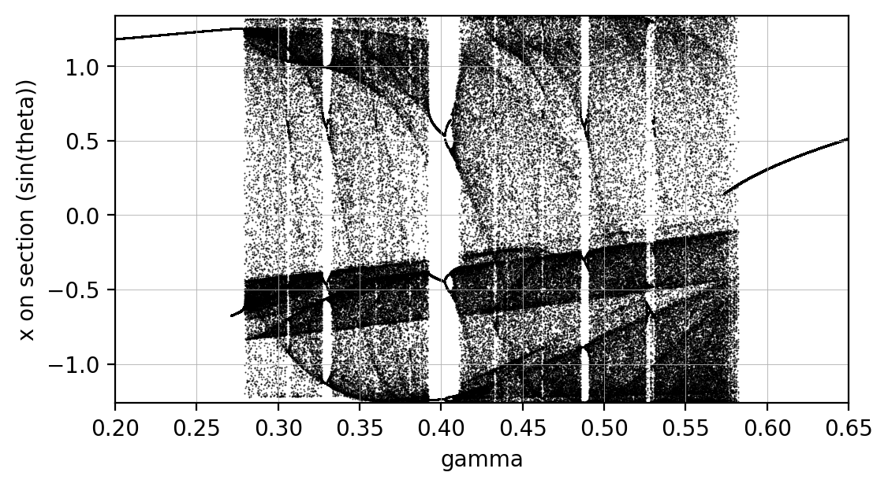
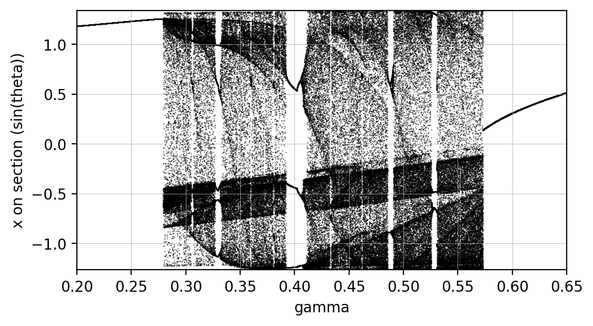
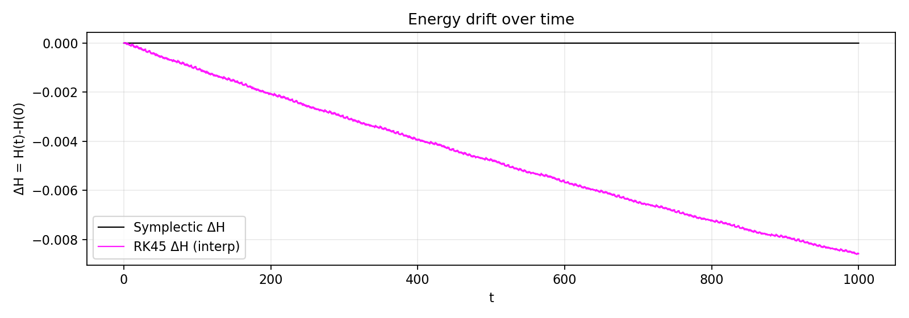
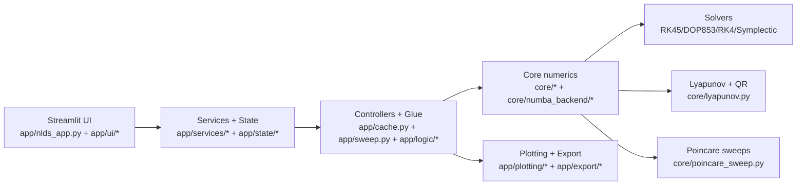

<div align="center">


# dynaSim (NLDS Simulator)

### Interactive Nonlinear Dynamical Systems Laboratory


</div>

dynaSim is a Streamlit-based platform for nonlinear dynamical systems.
It supports system simulation, Lyapunov spectrum estimation, and Poincare-driven parameter sweeps with continuation and optional parallelism.

## Why This Project

- Make nonlinear dynamics workflows accessible from one interactive environment.
- Combine educational exploration with research-grade numerical pipelines.
- Keep the path from UI experiment to reproducible export straightforward.
- Accelerate heavy workloads through Numba-backed kernels where applicable.

## What dynaSim Includes

- **Systems:** Lorenz, Rossler, Henon-Heiles (Hamiltonian), and custom nD systems.
- **Solvers:** RK45, DOP853, fixed-step RK4, symplectic Forest-Ruth.
- **Lyapunov Spectrum:** variational equations + periodic QR; analytic/symbolic or finite-difference Jacobians.
- **Poincare Sections:** plane or expression-based definitions; crossing/slab detection modes.
- **Poincaré Map (Tab 1):** section crossings extracted from the current trajectory and projected on selectable axes.
- **Sweeps:** bifurcation (reset ICs) and continuation (warm-start), with optional local parallelism.
- **Sweep observables:** Poincare crossings or local extrema (max/min/both) in Tab 3.
- **Acceleration:** automatic Numba backend for fixed-step RK4, symplectic FR, and Lyapunov paths.
- **Axis controls:** explicit axis limits and optional square/equal-scale view for phase, bifurcation, and Lyapunov charts.
- **Cloud-safe execution:** bounded in-memory trajectory samples, plot decimation, and bounded sweep row retention with recent-buffer plus reservoir history.
- **Export:** trajectories, sweeps, and Lyapunov results to CSV, with chunked trajectory export for very large runs.
- **Manuals in App:** English and Greek HTML manuals from `docs/user-guide/`.

## Visual Snapshot

The Lorenz attractor, reconstructed from a single nD initial-value run:

<div align="center">



</div>

A strange attractor on a Poincaré section (Duffing) next to a bifurcation diagram
built from Poincaré crossings (4D hyperchaotic Lorenz-type system, reproducing
Volos et al. 2016):

<div align="center">




</div>

Bifurcation (reset ICs) vs continuation (warm start) for the same Duffing sweep —
the continuation branch follows a single attractor and misses the period doubling
the reset sweep exposes:

<div align="center">




</div>

Why solver choice matters: energy drift of a symplectic integrator vs RK45 on the
Hénon–Heiles Hamiltonian — the symplectic curve stays flat while RK45 leaks energy:

<div align="center">



</div>

## Architecture (High Level)



For the layer rules and contracts, see [docs/developer/architecture.md](docs/developer/architecture.md).

## Ways To Use dynaSim

### Local (recommended)

Best for heavy runs — long integration horizons, dense parameter sweeps, or
Lyapunov spectra over many parameter values — where cloud runtime limits get in
the way.

**Option A — Docker** (cleanest; isolates dependencies from your system):

```bash
git clone https://github.com/OdyGoundi/nds-simulator.git
cd nds-simulator
docker build -t dynasim .
docker run --rm -p 8501:8501 dynasim
```

Then open `http://localhost:8501` in a browser.

**Option B — Python + pip** (use this if you want to edit the code or call the
numerical core outside Streamlit):

```bash
git clone https://github.com/OdyGoundi/nds-simulator.git
cd nds-simulator
python3 -m venv .venv
source .venv/bin/activate            # Windows (PowerShell): .\.venv\Scripts\Activate.ps1
python -m pip install --upgrade pip
python -m pip install -r requirements.txt
streamlit run app/nlds_app.py
```

### Cloud (online)

For quick demos, trying the interface, and small simulations:

- `https://nlds-simulator.streamlit.app`

Not recommended for demanding sweeps, very long integration horizons, or
memory-heavy computations — use a local run for those.

## Large Runs (Streamlit Cloud)

When running very large `tf/dt` combinations:

- Use `Max stored trajectory samples` in Tab 1 to cap trajectory memory.
- Use `Max points per plot` to decimate plotting data without changing integration horizon.
- In Tab 1, `Show Poincaré map` reuses the current trajectory and applies its own `Max points` display cap.
- Export long trajectories in chunks from Tab 4 (`Trajectory chunk size` + `Chunk number`).
- In Tab 3, recent sweep rows stay at full resolution while older dropped rows are kept in a bounded reservoir sample.
- Keep in mind: memory is bounded, but very large runs can still hit CPU/time limits in cloud runtimes.

## Documentation Map

- User guide: `docs/user-guide/`
  - Custom systems (equation syntax): `docs/user-guide/custom-systems.md`
- Manuals (HTML):
  - English: `docs/user-guide/manual.html`
  - Greek: `docs/user-guide/manual-el.html`
- Theory notes: `docs/theory/`
- Developer docs: `docs/developer/`
  - Architecture (layers + contracts): `docs/developer/architecture.md`
  - Sweep engine (Tab 3): `docs/developer/sweep-engine.md`
  - Session state (typed keys): `docs/developer/session-state.md`

## Project Info

- Developed as part of the master thesis of **Odysseas Gkountinakos**.
- MSc Program in Computational Physics, Department of Physics, Aristotle University of Thessaloniki.
- Supervisor: **Christos Volos**, Professor.
- Source: `https://github.com/OdyGoundi/nds-simulator`
- Contact: `ody.gkount@gmail.com`

## License

This project is free software under the **GNU GPL v3.0**.

- Full license text: [LICENSE](LICENSE)
- © 2026 Odysseas Gkountinakos
