# Code Reader Guide

A practical, file-by-file map of the `dynaSim / nds-simulator` codebase as it
exists on `refactor/codebase-cleanup` after refactoring phases 4.1–4.10.

This guide answers four questions:

1. **What is the entry point?**
2. **How do the files connect today?**
3. **In what order should the code be read?**
4. **Where do common changes go?**

Companion documents:
- [architecture.md](./architecture.md) — layer responsibilities and contracts
- [refactoring.md](./refactoring.md) — what changed and why
- [README.md](./README.md) — Numba decision tree per execution path

---

## 1. TL;DR

To understand the whole project quickly, read in this order:

1. `app/nlds_app.py` — composition root (~320 lines)
2. `app/params.py` — dataclass contracts
3. `app/state/defaults.py` and `app/state/session_keys.py`
4. `app/services/system_registry.py` — built-in systems
5. `app/services/solver_policy.py` — solver dispatch
6. `app/cache.py` — cached single-run trajectories
7. `app/ui/tabs/phase_tab.py` — Tab 1
8. `app/ui/tabs/sweep_tab.py` — Tab 3 orchestrator
9. `core/solver.py` and `core/poincare_sweep.py`

Quick by-area entry points:

| You care about | Start with |
|---|---|
| UI only | `nlds_app.py`, `ui/sidebar.py`, `ui/tabs/*`, `ui/sweep_controls.py`, `ui/sweep_plot_panel.py` |
| Services | `services/system_registry.py`, `services/solver_policy.py`, `services/lyapunov_service.py`, `services/sweep_run_service.py`, `services/sweep_state_service.py`, `services/export_service.py` |
| Plotting | `app/plotting/` (one module per plot kind) |
| Pure numerics | `core/solver.py`, `core/poincare_sweep.py`, `core/lyapunov.py`, `core/numba_backend/*` |
| Custom-system parsing | `app/parsing/*` |

---

## 2. Entry point

### `app/nlds_app.py` (~320 lines)

Run with:

```bash
streamlit run app/nlds_app.py
```

This file is a **composition root** — no widget logic, no system dispatch,
no sweep orchestration. It does:

- imports and `sys.path` setup
- `st.set_page_config(...)` and header rendering via `render_header_logo(...)`
- help/info dialog plumbing
- `flush_pending_static_config_apply()` for uploaded configs
- sidebar via `render_system_sidebar(...)`
- the four tabs:

```python
phase_result = render_phase_tab(tabs[0], system_key=..., var_names=..., ...)
render_time_series_tab(tabs[1], phase_result=phase_result)
render_sweep_tab(tab=tabs[2], system=..., integration=..., ...)
render_export_tab(tabs[3], phase_result=phase_result, ...)
```

Tabs 2 and 4 read from `phase_result` (a `PhaseTabResult` dataclass) so
the trajectory is not re-solved.

---

## 3. High-level dependency graph

```mermaid
flowchart TD
  A[app/nlds_app.py]

  A --> SBR[app/ui/sidebar.py]
  A --> BR[app/ui/branding.py]
  A --> HP[app/ui/help_panels.py]
  A --> PT[app/ui/tabs/phase_tab.py]
  A --> TST[app/ui/tabs/time_series_tab.py]
  A --> ST[app/ui/tabs/sweep_tab.py]
  A --> ET[app/ui/tabs/export_tab.py]
  A --> APPLY[app/state/apply_config.py]

  PT --> CACHE[app/cache.py]
  PT --> LYC[app/logic/lyapunov_cached.py]
  PT --> PMP[app/ui/poincare_map_panel.py]
  PT --> PLOT[app/plotting/*]

  TST --> PLOT

  ST --> SC[app/ui/sweep_controls.py]
  ST --> SPP[app/ui/sweep_plot_panel.py]
  ST --> SRS[app/services/sweep_run_service.py]

  SC --> SSS[app/services/sweep_state_service.py]
  SC --> SREG[app/services/system_registry.py]

  SPP --> SSS
  SPP --> EXPU[app/export_utils.py]
  SPP --> PLOT

  ET --> EXPS[app/services/export_service.py]
  ET --> EXPU

  SRS --> BIF[app/logic/bifurcation_sweep.py]
  SRS --> LSW[app/logic/lyapunov_sweep.py]
  SRS --> SWPC[app/sweep.py]

  CACHE --> SREG
  CACHE --> SPOL[app/services/solver_policy.py]
  CACHE --> SOL[core/solver.py]
  CACHE --> SYM[core/symplectic_solver.py]

  LYC --> LYS[app/services/lyapunov_service.py]
  LSW --> LYS
  LYS --> LCORE[core/lyapunov.py]

  SWPC --> PSWEEP[core/poincare_sweep.py]

  SREG --> RHS[core/*_rhs.py]
  SREG --> JAC[core/jacobians_fixed_systems.py]

  CACHE --> NUMBA[core/numba_backend/*]
  SWPC --> NUMBA
  LYS --> NUMBA

  PMP --> PMAP[app/logic/poincare_map.py]
  PMAP --> PSWEEP

  EXPS --> CSV[app/export/csv_utils.py]
```



The pattern is consistent:

- `app/ui/*` = UI composition (small, single-concern files)
- `app/ui/tabs/*` = thin orchestrators (one per tab)
- `app/services/*` = registries, dispatch, business logic
- `app/state/*` = session-state defaults, typed keys, apply layer
- `app/parsing/*` = parsing and symbolic builders (incl. Numba codegen)
- `app/plotting/*` = one module per plot kind, plus bounds + downsampling
- `app/export/*` = CSV builders
- `app/logic/*` = controllers near numerics
- `core/*` = pure numerics
- `core/numba_backend/*` = JIT-accelerated mirror

---

## 4. Folder structure

### `app/` (root)

| File | Lines | Purpose |
|---|---|---|
| `nlds_app.py` | 318 | Composition root. Header, sidebar, four `render_*_tab` calls. |
| `params.py` | 78 | Frozen dataclass contracts: `IntegrationConfig`, `InitialConditions`, `SolverTolerances`, `SystemConfig`, `LorenzParams`, `RosslerParams`, `HenonHeilesParams`, `CustomSystemDefinition`, `LyapunovConfig`, `SweepRunConfig`. |
| `cache.py` | 229 | `solve_cached(...)` (`@st.cache_data`). Dispatches Numba/scalar via `system_registry` and `solver_policy`. |
| `sweep.py` | 752 | `run_sweep_chunk(...)` plus six per-path runners. Single dispatch surface for all sweep observables. |
| `export_utils.py` | 303 | Public: `build_static_config`, `build_sweep_config`. Everything else is private. |
| `numba_custom.py` | 120 | JIT compile + cache for custom-system kernels. Parsing lives in `parsing/numba_rhs_builder.py`. |
| `helpers.py` | 13 | Re-export shim for backwards compatibility. New code imports from the real module. |

### `app/ui/`

The Streamlit UI layer.

| File | Lines | Purpose |
|---|---|---|
| `sidebar.py` | 217 | `render_system_sidebar()` → `SidebarSystemResult`. System selection, custom editor, symplectic preview. |
| `branding.py` | 111 | Header, logo, theme-aware logo selection. |
| `help_panels.py` | 78 | Manual (EN/EL), info dialog, `st.dialog` helper. |
| `widgets.py` | 49 | `slider_with_input(...)` reusable pair. |
| `poincare_map_panel.py` | 177 | Tab 1 Poincaré section panel. |
| `sweep_controls.py` | 689 | Tab 3 widgets only → `SweepControlsResult`. |
| `sweep_plot_panel.py` | 387 | Tab 3 plots, axis bounds, config save/upload. |

### `app/ui/tabs/`

| File | Lines | Purpose |
|---|---|---|
| `phase_tab.py` | 633 | Tab 1: phase plot + Lyapunov + Poincaré controls. Returns `PhaseTabResult`. |
| `time_series_tab.py` | 136 | Tab 2: reads `PhaseTabResult` (no resolve), time-window controls, multi-var + per-var plots. |
| `sweep_tab.py` | 127 | Tab 3 orchestrator: controls → execute → plots. |
| `export_tab.py` | 354 | Tab 4: configurations, trajectory CSV, sweep CSV, Lyapunov CSV, run-bundle zip. |

#### Tab 3 split (`SweepControlsResult` contract)

Tab 3 lives in three files joined by a frozen dataclass:

```text
with tab:
    ctrl = render_sweep_controls(...)              # → SweepControlsResult
    df_plot = execute_*_sweep(...)                 # 4 service entry points
    render_sweep_plots(ctrl, df_plot)              # plots + config save/upload
```

`SweepControlsResult` carries every config object, button state, and column
handle from controls to plot panel.

### `app/services/`

| File | Lines | Purpose |
|---|---|---|
| `system_registry.py` | 205 | `SystemAdapter` + `BUILTIN_SYSTEMS` for lorenz/rossler/henon_heiles. `get_builtin(key)`. |
| `solver_policy.py` | 41 | `resolve_solver(raw)` → `SolverPolicy`. Normalizes solver kind, picks SciPy method. |
| `lyapunov_service.py` | 237 | Single-run + shared helpers (`resolve_time_window`, `build_lyapunov_rhs_jac`, `build_numba_lyap_solver`, `run_lyapunov_numba`, `run_lyapunov_scipy`, `compute_single_lyapunov`). |
| `sweep_run_service.py` | 312 | Four entry points: `execute_new_bif_sweep`, `execute_cont_bif_sweep`, `execute_new_lya_sweep`, `execute_cont_lya_sweep`. |
| `sweep_state_service.py` | 214 | Sweep state init/reset/clip, continuation compatibility, accumulation, reservoir helpers. |
| `export_service.py` | 87 | `build_zip_bytes(...)`, `build_run_bundle(...)`. |

### `app/state/`

| File | Lines | Purpose |
|---|---|---|
| `defaults.py` | 32 | System labels, solver labels, the few reserved-key constants, UI defaults. |
| `session_keys.py` | 173 | Typed key classes: `PhaseKeys`, `IntegrationKeys`, `LyapunovTab1Keys`, `SystemParamKeys`, `TolKeys`, `SidebarKeys`, `StaticConfigKeys`, `TimeSeriesKeys`, `SweepControlsKeys`, `BifPlotKeys`, `LyaPlotKeys`, `SweepDataKeys`, `LyapunovDataKeys`, `ExportKeys`, `HelpPanelKeys`. |
| `apply_config.py` | 217 | `apply_state_values(...)`, `apply_static_config_to_state(...)`, `flush_pending_static_config_apply()`, casting helpers. |

### `app/parsing/`

| File | Lines | Purpose |
|---|---|---|
| `params_parser.py` | 18 | `parse_params(text)`. |
| `vector_parser.py` | 11 | `parse_list_of_floats(text, n, label)`. |
| `custom_rhs_builder.py` | 52 | `build_custom_rhs(...)`. |
| `custom_jacobian_builder.py` | 100 | `build_custom_rhs_and_jacobian(...)`, `build_custom_symbolic_jacobian_str(...)`. |
| `custom_symplectic_builder.py` | 95 | `build_custom_symplectic_functions(...)`. |
| `numba_rhs_builder.py` | 233 | sympy → Python source for Numba kernels (RHS, Jacobian, symplectic). No JIT here. |
| `_safe_funcs.py` | 9 | `SAFE_FUNCS` for sympy lambdify. |

### `app/plotting/`

| File | Lines | Purpose |
|---|---|---|
| `phase.py` | 49 | `plot_phase_2d`, `plot_phase_3d`. |
| `time_series.py` | 47 | `plot_time_series` (multi-var overlay), `plot_single_variable`. |
| `sweep.py` | 44 | `plot_bifurcation`. |
| `lyapunov.py` | 49 | `plot_lyapunov_sweep`. |
| `bounds.py` | 35 | `axis_bounds`, `square_xy_bounds`. |
| `style.py` | 4 | `LINE_COLORS` palette. |
| `downsampling.py` | 61 | `decimate_indices`, `downsample_trajectory`, `downsample_xy`, `apply_transient_cut`. |

### `app/export/`

| File | Lines | Purpose |
|---|---|---|
| `csv_utils.py` | 46 | `build_csv_bytes(...)` streaming CSV builder. |

### `app/logic/`

Controllers near numerics.

| File | Lines | Purpose |
|---|---|---|
| `bifurcation_sweep.py` | 97 | Parallel orchestration around `run_sweep_chunk`. |
| `lyapunov_sweep.py` | 206 | Parametric Lyapunov loop on top of `lyapunov_service`. |
| `lyapunov_cached.py` | 22 | `@st.cache_data` shim over the service. |
| `poincare_map.py` | 159 | Typed wrapper over `core.poincare_sweep.poincare_section`. |
| `reservoir_sampling.py` | 118 | Bounded sweep visualization sampling. |
| `sweep_utils.py` | 87 | Worker count helper, fingerprint, chunk helpers. |

### `core/`

Pure numerics.

| File | Lines | Purpose |
|---|---|---|
| `solver.py` | 189 | `integrate_system(...)` (SciPy `solve_ivp`), `integrate_system_rk4(...)`. |
| `symplectic_solver.py` | 279 | Verlet, Forest-Ruth integrators. |
| `poincare_sweep.py` | 566 | `PoincareConfig`, `SweepConfig`, `poincare_section`, `sweep_poincare_events_ivp`, `sweep_poincare`. |
| `lyapunov.py` | 409 | QR-based `compute_lyapunov_spectrum(...)`. |
| `jacobians_fixed_systems.py` | 81 | `lorenz_jac`, `rossler_jac`, `thomas_jac`, `henon_heiles_jac`. |
| `lorenz_system_rhs.py` | 19 | Lorenz RHS. |
| `rossler_system_rhs.py` | 26 | Rossler RHS. |
| `henon_heiles_system_rhs.py` | 42 | Henon-Heiles RHS and split Hamiltonian pieces. |

#### `core/numba_backend/`

| File | Lines | Purpose |
|---|---|---|
| `__init__.py` | 18 | Public API. |
| `_common.py` | 16 | Numba availability/guards. |
| `_linalg.py` | 63 | JIT matrix multiply + QR. |
| `builtins.py` | 166 | Compiled built-in systems. |
| `integrators.py` | 175 | JIT RK4 + Forest-Ruth. |
| `lyapunov.py` | 204 | JIT Lyapunov path. |
| `sweep.py` | 160 | JIT RK4 Poincaré sweep. |

### `legacy/`

Notebook-era predecessors. Not on the runtime path.

| Item | What it was |
|---|---|
| `nds_app.py` | Early single-file Streamlit app |
| `app_lorenz.py` | Minimal Lorenz-only Streamlit demo |
| `in_out/` | Early I/O helpers |
| `plotting/` | Early plotting helpers (superseded by `app/plotting/`) |

---

## 5. Recommended reading paths

### Path A — "Understand the whole app" (~30 min)

1. [README.md](../../README.md)
2. `app/nlds_app.py`
3. `app/params.py`
4. `app/state/defaults.py`, `app/state/session_keys.py`, `app/state/apply_config.py`
5. `app/cache.py`
6. `app/services/system_registry.py`, `app/services/solver_policy.py`
7. `app/ui/tabs/phase_tab.py`
8. `app/ui/tabs/sweep_tab.py`
9. `app/services/sweep_run_service.py`

### Path B — "Understand the numerics engine"

1. `core/solver.py`
2. `core/symplectic_solver.py`
3. `core/poincare_sweep.py`
4. `core/lyapunov.py`
5. `core/jacobians_fixed_systems.py`
6. `core/numba_backend/*`

### Path C — "Understand Tab 3 (sweep)"

1. `app/ui/tabs/sweep_tab.py` (orchestrator)
2. `app/ui/sweep_controls.py` (widgets + `SweepControlsResult`)
3. `app/services/sweep_state_service.py` (state init/reset/clip)
4. `app/services/sweep_run_service.py` (4 execution entry points)
5. `app/ui/sweep_plot_panel.py` (plots + config save/upload)
6. `app/sweep.py` (chunk dispatcher + per-path runners)
7. `app/logic/bifurcation_sweep.py`, `app/logic/lyapunov_sweep.py`
8. `core/poincare_sweep.py`, `core/lyapunov.py`

### Path D — "Understand single-run Lyapunov"

1. `app/ui/tabs/phase_tab.py` (call site)
2. `app/logic/lyapunov_cached.py` (cache wrapper)
3. `app/services/lyapunov_service.py` (`compute_single_lyapunov` + helpers)
4. `app/services/system_registry.py` (RHS/Jacobian dispatch)
5. `app/services/solver_policy.py`
6. `core/lyapunov.py`

### Path E — "Custom systems pipeline"

1. `app/ui/sidebar.py` (text input for variables, equations, params)
2. `app/parsing/params_parser.py`, `vector_parser.py`
3. `app/parsing/custom_rhs_builder.py`, `custom_jacobian_builder.py`,
   `custom_symplectic_builder.py`
4. `app/parsing/numba_rhs_builder.py` (sympy → Python source)
5. `app/numba_custom.py` (compile + cache)

---

## 6. Call mapping

### Single trajectory

```
app/nlds_app.py
  → app/ui/tabs/phase_tab.render_phase_tab(...)
    → app/cache.solve_cached(...)
      → app/services/system_registry.get_builtin(...) or custom RHS
      → app/services/solver_policy.resolve_solver(...)
      → core/solver.py or core/symplectic_solver.py
      → optional core/numba_backend/*
    → app/plotting/phase.plot_phase_2d/3d
    → app/ui/poincare_map_panel.render_poincare_map_panel(...)
```

### Single Lyapunov

```
app/nlds_app.py
  → app/ui/tabs/phase_tab.render_phase_tab(...)
    → app/logic/lyapunov_cached.compute_lyapunov_cached(...)
      → app/services/lyapunov_service.compute_single_lyapunov(...)
        → system_registry for RHS/Jacobian
        → solver_policy
        → core/lyapunov.compute_lyapunov_spectrum(...) (or Numba path)
```

### Bifurcation / continuation sweep

```
app/nlds_app.py
  → app/ui/tabs/sweep_tab.render_sweep_tab(...)
    ├─ app/ui/sweep_controls.render_sweep_controls(...) → SweepControlsResult
    ├─ app/services/sweep_run_service.execute_{new,cont}_bif_sweep(...)
    │    → app/logic/bifurcation_sweep._run_bifurcation_parallel(...)
    │    → app/sweep.run_sweep_chunk(...) → per-path runner
    │      → core/poincare_sweep.*  (or numba_backend.sweep)
    └─ app/ui/sweep_plot_panel.render_sweep_plots(ctrl, df_plot)
        → app/plotting/sweep.plot_bifurcation(...)
```

### Lyapunov sweep

```
app/nlds_app.py
  → app/ui/tabs/sweep_tab.render_sweep_tab(...)
    ├─ app/ui/sweep_controls.render_sweep_controls(...)
    ├─ app/services/sweep_run_service.execute_{new,cont}_lya_sweep(...)
    │    → app/logic/lyapunov_sweep._run_lyapunov_sweep(...)
    │    → app/services/lyapunov_service.run_lyapunov_{numba,scipy}(...)
    │    → core/lyapunov.compute_lyapunov_spectrum(...) (or Numba path)
    └─ app/ui/sweep_plot_panel.render_sweep_plots(ctrl, df_plot)
        → app/plotting/lyapunov.plot_lyapunov_sweep(...)
```

### Time series (Tab 2)

```
app/nlds_app.py
  → app/ui/tabs/time_series_tab.render_time_series_tab(tabs[1], phase_result=...)
      reads PhaseTabResult.t_plot / y_plot — no re-solve
    → app/plotting/time_series.plot_time_series(...) and plot_single_variable(...)
```

### Export bundle (Tab 4)

```
app/nlds_app.py
  → app/ui/tabs/export_tab.render_export_tab(tabs[3], phase_result=...)
    → app/export_utils.build_static_config(...) (config dict)
    → app/services/export_service.build_run_bundle(...) (zip bytes)
        → app/export/csv_utils.build_csv_bytes(...)
        → app/services/export_service.build_zip_bytes(...)
```

---

## 7. Notes for new readers

### 7.1 Tab 3 is three files joined by a contract

The old monolithic `bifurcation_tab.py` is gone. In its place:

- `app/ui/tabs/sweep_tab.py` — composition + execution glue
- `app/ui/sweep_controls.py` — widgets + `SweepControlsResult`
- `app/ui/sweep_plot_panel.py` — plots + config save/upload

`SweepControlsResult` (frozen dataclass) is the contract.

### 7.2 Tabs 2 and 4 reuse Tab 1's solve

`PhaseTabResult` carries `t`, `y`, `t_plot`, `y_plot`, `var_names`, axis
indices, and all configs. Tab 2 reads it for time-series plots; Tab 4 reads
it for trajectory export. The solver runs once per parameter set.

### 7.3 System dispatch goes through a registry

`app/services/system_registry.py` provides:

- `BUILTIN_SYSTEMS: dict[str, SystemAdapter]`
- `get_builtin(key) → SystemAdapter` with `rhs_fn`, `rhs_builder`,
  `jac_builder`, `extract_params`, `rhs_from_dict`, `jac_from_dict`,
  `dimension`, `param_names`, `dq_dp_builder`

Used in `cache.py`, `sweep.py`, `lyapunov_service.py`, sidebar.

### 7.4 Solver dispatch goes through a policy

`app/services/solver_policy.resolve_solver(raw_kind)` returns a
`SolverPolicy` with:

- `kind` (normalized: `rk4`, `rk45`, `dop853`, `symplectic_fr`, `ivp`)
- `scipy_method` (for SciPy paths)
- `auto_switch_rk4`, `sweep_kind`

### 7.5 Session-state keys are typed

Session-state keys are no longer bare strings. Use
`app/state/session_keys.py`:

```python
from app.state import PhaseKeys, SweepDataKeys, IntegrationKeys

st.session_state[PhaseKeys.X_IDX]            # was "phase_x_idx_tab1"
st.session_state[SweepDataKeys.ACC_DF]       # was "sweep_acc_df"
st.number_input("t0", key=IntegrationKeys.T0)
```

JSON config-dict keys (e.g. `solve_opts.get("rtol")`) stay as literals —
they reflect the exported JSON schema.

### 7.6 `app/helpers.py` is a 13-line re-export shim

Don't import from it in new code. Use the real modules:

```python
from app.parsing import parse_params
from app.plotting import downsample_xy, axis_bounds, plot_phase_2d
from app.export import build_csv_bytes
from app.ui.widgets import slider_with_input
```

### 7.7 Plotting is centralized

Every plot lives in `app/plotting/<kind>.py`. Plot functions are pure: data
+ view bounds in, `Figure` out. UI files don't call `plt.subplots` directly
anymore.

### 7.8 The Numba backend is builder-based

There are no fixed JIT kernels. The flow is:

1. Build RHS/Jacobian (built-in via `numba_backend.build_builtin_system`,
   or custom via `numba_custom.build_custom_numba_*`).
2. Pass the compiled RHS/Jacobian to a builder
   (`build_rk4_integrator`, `build_symplectic_fr_integrator`,
   `build_lyapunov_solver`, `build_poincare_sweep_rk4`).
3. Call the resulting JIT function.

Compilation happens on first call. Custom-system kernels are cached per
`(var_names, eq_lines, param_names)`.

### 7.9 Custom systems flow through symbolic parsing

For custom systems:

- `app/parsing/params_parser.py` → param values
- `app/parsing/custom_rhs_builder.py` → scalar RHS callable
- `app/parsing/custom_jacobian_builder.py` → analytic Jacobian (if `auto_jac` set)
- `app/parsing/custom_symplectic_builder.py` → split functions for symplectic
- `app/parsing/numba_rhs_builder.py` → Python source for Numba kernels
- `app/numba_custom.py` → JIT compile + cache

---

## 8. Where to add what

### A new built-in system

1. RHS in `core/<name>_system_rhs.py`
2. Optional analytic Jacobian in `core/jacobians_fixed_systems.py`
3. New `SystemAdapter` and entry in `BUILTIN_SYSTEMS`
   (`app/services/system_registry.py`)
4. System label in `app/state/defaults.py` and UI controls in
   `app/ui/sidebar.py`
5. Optional Numba kernel in `core/numba_backend/builtins.py`

### A new solver

1. Logic in `core/solver.py` or `core/symplectic_solver.py`
2. Update `app/services/solver_policy.resolve_solver(...)` for
   normalization + scipy method
3. UI exposure in `app/ui/sidebar.py`
4. If JIT-able, add a builder to `core/numba_backend/integrators.py` and
   a `_try_numba_*` helper in `app/cache.py`

### A new sweep observable

1. `app/sweep.py` (`run_sweep_chunk` recognizes the observable; consider
   a new `_run_*_chunk` helper if it doesn't fit existing paths)
2. `app/ui/sweep_controls.py` (UI dropdown)
3. Possibly `core/poincare_sweep.py` if a new mechanism is needed

### A new export format

1. `app/export/<format>.py` (or extend `csv_utils.py`)
2. Update `app/services/export_service.build_run_bundle(...)`
3. UI hook in `app/ui/tabs/export_tab.py`

### A new tab

1. New `app/ui/tabs/<name>_tab.py` with `render_<name>_tab(tab, *, ...)`
2. Hook in `app/nlds_app.py` (`render_<name>_tab(tabs[N], ...)`)
3. If it needs trajectory data, accept `phase_result: PhaseTabResult`
4. If it has session state, add a key class in
   `app/state/session_keys.py`

### A new session-state key

1. Add a member to the right class in `app/state/session_keys.py`
2. Use the constant — never the literal string

---

## 9. Mental model

After the refactor, the right mental model is:

- `app/nlds_app.py` = front door (composition root only)
- `app/ui/tabs/*` = one thin orchestrator per tab
- `app/ui/*.py` = small focused renderers (sidebar, branding, help, sweep
  controls, sweep plots, poincare panel, widgets)
- `app/services/*` = registries + dispatch + business logic
- `app/state/*` = defaults + typed keys + apply layer
- `app/parsing/*`, `app/plotting/*`, `app/export/*` = small utilities,
  one clear job each
- `app/logic/*` = sweep / Lyapunov controllers near numerics
- `app/cache.py`, `app/sweep.py` = glue between UI/services and `core/`
- `core/*` = pure numerics
- `core/numba_backend/*` = JIT-accelerated mirror
- `legacy/*` = notebook-era predecessors, not on the runtime path
- `scripts/*`, `tests/*` = supporting ecosystem
