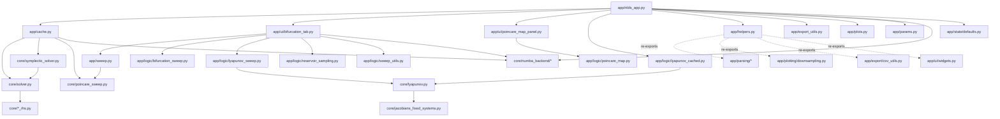

# Οδηγός Ανάγνωσης Κώδικα

Αυτό το αρχείο είναι ο κεντρικός οδηγός εξερεύνησης του κώδικα του `dynaSim / nds-simulator`.

Στόχος του είναι να απαντά σε τέσσερα πρακτικά ερωτήματα:

1. Ποιο είναι το πραγματικό entrypoint της εφαρμογής;
2. Πώς συνδέονται τα αρχεία μεταξύ τους;
3. Ποια αρχεία είναι μέρος του κύριου runtime path και ποια είναι βοηθητικά, tests ή legacy;
4. Με ποια σειρά αξίζει να διαβαστεί ο κώδικας;

Το αρχείο αυτό δεν αντικαθιστά τα πιο μικρά developer notes:

- [architecture.md](./architecture.md)
- [sweep-engine.md](./sweep-engine.md)
- [performance.md](./performance.md)
- [README.md](./README.md)

Είναι όμως το πιο πλήρες “map” του repo.

---

## 1. TL;DR

Αν θέλεις να καταλάβεις γρήγορα το project, διάβασε με αυτή τη σειρά:

1. `app/nlds_app.py`
2. `app/params.py`
3. `app/cache.py`
4. `app/ui/bifurcation_tab.py`
5. `app/logic/lyapunov_cached.py`
6. `app/logic/lyapunov_sweep.py`
7. `app/sweep.py`
8. `core/solver.py`
9. `core/poincare_sweep.py`
10. `core/lyapunov.py`
11. `core/symplectic_solver.py`
12. `core/numba_backend/*`

Αν ο στόχος σου είναι μόνο το UI:

1. `app/nlds_app.py`
2. `app/ui/bifurcation_tab.py`
3. `app/ui/poincare_map_panel.py`
4. `app/ui/widgets.py`
5. `app/state/defaults.py`
6. `app/export_utils.py`

Αν ο στόχος σου είναι μόνο το parsing / custom-system layer:

1. `app/parsing/params_parser.py`
2. `app/parsing/vector_parser.py`
3. `app/parsing/custom_rhs_builder.py`
4. `app/parsing/custom_jacobian_builder.py`
5. `app/parsing/custom_symplectic_builder.py`
6. `app/numba_custom.py`

Αν ο στόχος σου είναι μόνο τα numerics:

1. `core/solver.py`
2. `core/symplectic_solver.py`
3. `core/poincare_sweep.py`
4. `core/lyapunov.py`
5. `core/jacobians_fixed_systems.py`
6. `core/numba_backend/*`

---

## 2. Ποιο είναι το main entrypoint

### `app/nlds_app.py`

Αυτό είναι το **κύριο Streamlit app**.

Τρέχει με:

```bash
streamlit run app/nlds_app.py
```

Από εδώ ξεκινούν:

- η επιλογή συστήματος,
- οι ρυθμίσεις ολοκλήρωσης,
- το phase portrait,
- οι χρονοσειρές,
- ο single-run υπολογισμός Lyapunov,
- το Tab 3 για bifurcation / continuation / Lyapunov sweeps,
- τα exports.

Το `app/nlds_app.py` δεν κάνει όλη τη βαριά αριθμητική μόνο του. Κυρίως:

- διαχειρίζεται `session_state`,
- χτίζει configs,
- καλεί helpers / controllers,
- και συνθέτει τα tabs.

---

## 3. Υψηλού επιπέδου χάρτης εξαρτήσεων



Η βασική ιδέα είναι:

- `app/` = orchestration, UI, caching, export
- `core/` = numerics
- `core/numba_backend/` = accelerated numerics
- `scripts/` = standalone παραγωγικά βοηθητικά scripts
- `tests/` = tests, probes, benchmarks

---

## 4. Δομή φακέλων

### `app/`

Το application layer.

- UI (`ui/`)
- state management (`state/`)
- cached calls (`cache.py`)
- export/config builders (`export/`, `export_utils.py`)
- parsing και symbolic builders (`parsing/`)
- plotting helpers (`plotting/`, `plots.py`)
- custom-system helpers (`numba_custom.py`)
- thin re-export shim (`helpers.py`)

#### Νέα modules μετά το Phase 1 refactor

- `app/parsing/` — params/vector parsers, custom RHS / Jacobian / symplectic builders
- `app/plotting/downsampling.py` — decimation utilities
- `app/export/csv_utils.py` — CSV byte serialization
- `app/state/defaults.py` — system/solver registries και UI defaults
- `app/ui/widgets.py` — reusable Streamlit widgets (`slider_with_input`)

### `core/`

Ο αριθμητικός πυρήνας.

- γενικοί ODE solvers,
- symplectic solvers,
- Poincaré sweep logic,
- Lyapunov QR numerics,
- built-in RHS/Jacobians.

### `core/numba_backend/`

Ο accelerated backend.

- JIT integrators,
- JIT Lyapunov kernel,
- JIT sweep kernel,
- built-in compiled systems,
- μικρές linear algebra ρουτίνες.

### `scripts/`

Standalone scripts που δεν ανήκουν στο Streamlit runtime, αλλά παράγουν ειδικά outputs.

### `tests/`

Μείγμα από:

- κανονικά tests,
- benchmark scripts,
- validation scripts,
- notebooks για πειράματα.

### `docs/`

Documentation, thesis material, theory notes, user manuals.

### `in_out/` και `plotting/`

Παλιότερα βοηθητικά modules από notebook-era / prototype-era κώδικα.

### top-level legacy files

- `nds_app.py`
- `app_lorenz.py`
- `reference_pyhamsys.py`

Δεν είναι ο βασικός runtime path της τωρινής εφαρμογής.

---

## 5. Προτεινόμενη σειρά ανάγνωσης

### Διαδρομή A: “Θέλω να καταλάβω το app ως προϊόν”

1. `README.md`
2. `app/nlds_app.py`
3. `app/params.py`
4. `app/cache.py`
5. `app/ui/bifurcation_tab.py`
6. `app/ui/poincare_map_panel.py`
7. `app/export_utils.py`
8. `app/helpers.py`

### Διαδρομή B: “Θέλω να καταλάβω το numerics engine”

1. `core/solver.py`
2. `core/symplectic_solver.py`
3. `core/poincare_sweep.py`
4. `core/lyapunov.py`
5. `core/jacobians_fixed_systems.py`
6. `core/numba_backend/builtins.py`
7. `core/numba_backend/integrators.py`
8. `core/numba_backend/lyapunov.py`
9. `core/numba_backend/sweep.py`

### Διαδρομή C: “Θέλω να καταλάβω το Tab 3”

1. `app/ui/bifurcation_tab.py`
2. `app/sweep.py`
3. `app/logic/bifurcation_sweep.py`
4. `app/logic/lyapunov_sweep.py`
5. `app/logic/sweep_utils.py`
6. `app/logic/reservoir_sampling.py`
7. `core/poincare_sweep.py`
8. `core/lyapunov.py`

---

## 6. Mapping των βασικών modules

## 6.1 Main application path

### `app/nlds_app.py` — Κεντρικό Streamlit application

**Ρόλος**

Το βασικό entrypoint της εφαρμογής.

**Τι περιέχει**

- default values για built-in systems,
- synchronization του `session_state`,
- φόρτωση manuals / info panels,
- Tab 1: phase portrait + single Lyapunov,
- Tab 2: time series,
- Tab 3: parameter sweeps,
- Tab 4: export layer.

**Τι κάνει**

- αποφασίζει ποιο configuration είναι ενεργό,
- μετατρέπει UI state σε dataclass configs,
- καλεί `solve_cached(...)`,
- καλεί `compute_lyapunov_cached(...)`,
- καλεί `render_poincare_map_panel(...)`,
- καλεί `render_bifurcation_tab(...)`.

**Συνδέεται με**

- `app/cache.py`
- `app/helpers.py`
- `app/export_utils.py`
- `app/plots.py`
- `app/params.py`
- `app/ui/bifurcation_tab.py`
- `app/ui/poincare_map_panel.py`
- `core/numba_backend/*`

---

### `app/params.py` — Dataclass contracts του app

**Ρόλος**

Το schema layer της εφαρμογής.

**Τι περιέχει**

- `IntegrationConfig`
- `InitialConditions`
- `LorenzParams`
- `RosslerParams`
- `HenonHeilesParams`
- `CustomSystemDefinition`
- `SystemConfig`
- `SolverTolerances`
- `SweepRunConfig`
- `LyapunovConfig`

**Τι κάνει**

Σταθεροποιεί το interface ανάμεσα σε UI, controllers και numerics.

**Σημαντικό**

Αν αλλάζει το shape των inputs, εδώ είναι το πρώτο σημείο που πρέπει να κοιτάξεις.

---

### `app/cache.py` — Cached solves και legacy cached sweep wrapper

**Ρόλος**

Το cache boundary του app.

**Τι περιέχει**

- `solve_cached(...)`
- `sweep_cached(...)`

**Τι κάνει**

Το `solve_cached(...)`:

- διαλέγει RHS ανά system,
- διαλέγει solver path,
- επιχειρεί Numba path όπου γίνεται,
- αλλιώς γυρνά σε pure Python / SciPy path,
- επιστρέφει μόνο `(t, y)`.

Το `sweep_cached(...)`:

- είναι παλαιότερο wrapper για sweeps,
- υποστηρίζει custom/non-custom sweep execution,
- δεν είναι ο κύριος δρόμος του τωρινού Tab 3.

**Συνδέεται με**

- `core/solver.py`
- `core/symplectic_solver.py`
- `core/poincare_sweep.py`
- `app.helpers`
- `app.params`
- `core/numba_backend/*`

**Σημείωση**

Στο τωρινό app, ο κύριος δρόμος για Tab 3 δεν είναι το `sweep_cached`, αλλά το:

- `app/ui/bifurcation_tab.py`
- `app/sweep.py`
- `app/logic/bifurcation_sweep.py`
- `app/logic/lyapunov_sweep.py`

---

### `app/helpers.py` — Thin re-export shim (μετά το Phase 1 refactor)

**Ρόλος**

Μετά την Φάση 1 του refactoring, το `helpers.py` δεν περιέχει πλέον λογική.
Είναι ένα μικρό shim που κάνει re-export από τα νέα modules για να μη σπάσουν
τα παλιά imports σε όλο το app.

**Τι κάνει**

Re-exports από:

- `app/parsing/*` — parsers, custom RHS / Jacobian / symplectic builders
- `app/plotting/downsampling.py` — decimation / downsampling
- `app/export/csv_utils.py` — CSV byte builder
- `app/ui/widgets.py` — `slider_with_input`

**Σημείωση**

Νέος κώδικας πρέπει να κάνει import απ' ευθείας από το πραγματικό module.
Το `helpers.py` θα αφαιρεθεί όταν όλα τα call sites μεταφερθούν στα νέα paths.

---

### `app/parsing/` — Parsing και symbolic builders

**Ρόλος**

Καθαρό parsing layer για user input και symbolic-based builders.

**Files**

- `params_parser.py` — `parse_params(text)` για `name=value` lines
- `vector_parser.py` — `parse_list_of_floats(text, n, label)` για y0 / IC vectors
- `custom_rhs_builder.py` — `build_custom_rhs(...)` από symbolic equations
- `custom_jacobian_builder.py` — `build_custom_rhs_and_jacobian(...)` και
  `build_custom_symbolic_jacobian_str(...)` για analytic Jacobian και preview
- `custom_symplectic_builder.py` — `build_custom_symplectic_functions(...)`
  μαζί με τα `DQDT` / `DPDT` Protocols
- `_safe_funcs.py` — internal: `SAFE_FUNCS` dict (sin, cos, exp, sqrt, ...)
  που χρησιμοποιείται κοινά από τους custom builders

**Συνδέεται με**

- `sympy`
- consumers: `app/cache.py`, `app/sweep.py`, `app/numba_custom.py`,
  `app/logic/lyapunov_cached.py`, `app/logic/lyapunov_sweep.py`,
  `app/export_utils.py`, `app/ui/bifurcation_tab.py`, `app/nlds_app.py`

---

### `app/plotting/downsampling.py` — Memory-friendly point reduction

**Ρόλος**

Decimation utilities ώστε plots και exports να μη φορτώνουν εκατομμύρια σημεία
ανώφελα.

**Τι περιέχει**

- `decimate_indices(n_points, max_points)` — επιστρέφει uniformly spaced indices
- `downsample_trajectory(t, y, max_points)` — για trajectory δεδομένα
- `downsample_xy(x, y, max_points)` — για 2D scatter / line points

---

### `app/export/csv_utils.py` — CSV byte serialization

**Ρόλος**

Pure CSV serialization helper για trajectories.

**Τι περιέχει**

- `build_csv_bytes(t, y, var_names, *, chunk_rows, start, end, include_header)`
  γράφει `(t, y)` σε CSV bytes με streaming chunks ώστε να αντέχει μεγάλα runs

---

### `app/state/defaults.py` — System / solver constants

**Ρόλος**

Read-only constants για system labels, solver labels και UI defaults.

**Τι περιέχει**

- `SYSTEM_LABEL_BY_KEY`, `SYSTEM_KEY_BY_LABEL` — built-in systems mapping
- `SOLVER_LABEL_BY_KIND` — solver labels (rk45, dop853, rk4, symplectic_fr)
- session keys: `PENDING_STATIC_CFG_KEY`, `STATIC_CFG_APPLY_SUCCESS_KEY`, ...
- numerical UI defaults: `MAX_PLOT_POINTS_DEFAULT`, `EXPORT_CHUNK_ROWS_DEFAULT`,
  `PHASE_LINEWIDTH_DEFAULT`, ...
- export source labels: `TRAJ_EXPORT_SOURCE_STORED`, `TRAJ_EXPORT_SOURCE_FULL`

**Σημείωση**

Πριν το Phase 1 αυτά ήταν διασκορπισμένα στην κορυφή του `app/nlds_app.py`.
Είναι το πρώτο βήμα προς ένα κανονικό state layer.

---

### `app/ui/widgets.py` — Reusable Streamlit widgets

**Ρόλος**

Μικρά UI components που επαναχρησιμοποιούνται ανάμεσα σε tabs.

**Τι περιέχει**

- `slider_with_input(label, min_value, max_value, value, step, key, fmt)`
  — slider + number_input ζευγαρωμένα, με input που δεν clamp-άρει στα όρια
  του slider

---

### `app/plots.py` — Μικρό plotting layer

**Ρόλος**

Thin Matplotlib wrapper για τα βασικά plots της εφαρμογής.

**Τι περιέχει**

- `plot_phase_2d`
- `plot_phase_3d`
- `plot_time_series`
- `plot_time_seiries_functional`

**Τι κάνει**

Κρατάει το plotting API απλό και ξεχωρισμένο από το main UI.

---

### `app/export_utils.py` — Builders για reproducible configs

**Ρόλος**

Μετατρέπει το τρέχον UI state σε structured export payloads.

**Τι περιέχει**

- timestamps / git commit lookup
- system block builder
- integration block builder
- static config builder
- sweep config builder

**Τι κάνει**

Παράγει JSON-serializable configuration blocks για:

- single-run configuration,
- sweep configuration,
- metadata για reproducibility.

---

## 6.2 Tab 3: Parameter Sweep subsystem

### `app/ui/bifurcation_tab.py` — UI και orchestration για Tab 3

**Ρόλος**

Το σημαντικότερο UI/controller αρχείο μετά το `app/nlds_app.py`.

**Τι περιέχει**

- όλο το layout και state init του Tab 3,
- bifurcation controls,
- continuation controls,
- Lyapunov sweep controls,
- plot bounds / clipping / reset / continue logic,
- export of sweep config.

**Τι κάνει**

Συνδέει τα UI widgets με τις εκτελέσεις:

- `run_sweep_chunk(...)`
- `_run_bifurcation_parallel(...)`
- `_run_lyapunov_sweep(...)`

και μετά:

- αποθηκεύει accumulated results,
- κρατά meta/fingerprints,
- ανανεώνει τα plots.

**Συνδέεται με**

- `app/sweep.py`
- `app/logic/bifurcation_sweep.py`
- `app/logic/lyapunov_sweep.py`
- `app/logic/reservoir_sampling.py`
- `app/logic/sweep_utils.py`
- `app/export_utils.py`
- `core/poincare_sweep.py`
- `core/numba_backend/*`

---

### `app/sweep.py` — Single chunk sweep executor

**Ρόλος**

Ο βασικός εκτελεστής για ένα chunk παραμετρικού sweep.

**Τι περιέχει**

- observable normalization
- local extrema extraction
- row clipping / budget logic
- συλλογή observable hits
- `run_sweep_chunk(...)`

**Τι κάνει**

Για ένα εύρος παραμέτρου:

- τρέχει την ολοκλήρωση / section detection,
- υπολογίζει είτε Poincaré crossings είτε extrema,
- εφαρμόζει row budget,
- επιστρέφει rows που είναι έτοιμοι για plotting/DataFrame.

**Σημαντικό**

Αυτό είναι το core glue ανάμεσα στο UI του sweep και στο `core/poincare_sweep.py`.

---

### `app/numba_custom.py` — JIT builders για custom συστήματα

**Ρόλος**

Ο compiled companion του `app/helpers.py` για custom systems.

**Τι περιέχει**

- parsing και normalization symbolic expressions,
- RHS builder για custom systems,
- RHS + Jacobian builder,
- symplectic split builders για custom Hamiltonian-like systems,
- internal caches για να μην ξαναχτίζονται ίδια kernels.

**Τι κάνει**

Παίρνει τις custom εξισώσεις του χρήστη και προσπαθεί να τις μετατρέψει σε
Numba-compatible numerical kernels, ώστε τα custom μοντέλα να μπορούν να
χρησιμοποιήσουν accelerated RK4, Lyapunov ή symplectic paths.

**Συνδέεται με**

- `app/cache.py`
- `core/numba_backend/integrators.py`
- `core/numba_backend/lyapunov.py`

---

### `app/logic/bifurcation_sweep.py` — Parallel bifurcation orchestration

**Ρόλος**

Parallel wrapper γύρω από το `run_sweep_chunk(...)`.

**Τι περιέχει**

- `_run_bifurcation_chunk(...)`
- `_run_bifurcation_parallel(...)`

**Τι κάνει**

- σπάει το parameter range σε κομμάτια,
- τρέχει chunks με executors,
- ενώνει το αποτέλεσμα σε ένα DataFrame.

**Πότε χρησιμοποιείται**

Όταν το Tab 3 είναι σε independent / parallel mode.

---

### `app/logic/lyapunov_sweep.py` — Parametric Lyapunov sweep

**Ρόλος**

Το αντίστοιχο engine για sweep του Lyapunov spectrum.

**Τι περιέχει**

- `_run_lyapunov_chunk(...)`
- `_run_lyapunov_sweep(...)`

**Τι κάνει**

Για κάθε τιμή παραμέτρου:

- χτίζει RHS/Jacobian,
- καλεί `compute_lyapunov_spectrum(...)`,
- επιστρέφει `param_vals`, `lambdas`, `errors`.

**Συνδέεται με**

- `app.helpers`
- `core.lyapunov`
- built-in Jacobians / RHS

---

### `app/logic/sweep_utils.py` — Shared utilities για sweeps

**Ρόλος**

Μικρά κοινά helpers για το sweep subsystem.

**Τι περιέχει**

- cloud detection
- default worker count
- param chunking
- float range builder
- sweep fingerprinting

**Τι κάνει**

Συγκεντρώνει κοινή λογική ώστε να μη σκορπίζεται σε UI και controller.

---

### `app/logic/reservoir_sampling.py` — Bounded visualization memory

**Ρόλος**

Memory-safe sampling για μεγάλα sweeps.

**Τι περιέχει**

- reservoir creation
- state validation
- update logic
- retrieval logic

**Τι κάνει**

Κρατά αντιπροσωπευτικό subset σημείων όταν το πλήρες πλήθος είναι πολύ μεγάλο.

**Γιατί υπάρχει**

Για να μπορεί το Tab 3 να δουλεύει και σε μεγάλα sweeps χωρίς να εκραγεί το UI memory footprint.

---

## 6.3 Poincaré map subsystem

### `app/ui/poincare_map_panel.py` — Tab 1 Poincaré panel

**Ρόλος**

UI panel για υπολογισμό / plotting τομών Poincaré πάνω σε ήδη υπολογισμένη τροχιά.

**Τι περιέχει**

- axis naming helpers
- `render_poincare_map_panel(...)`

**Τι κάνει**

- παίρνει `t, y` από το single-run,
- ρυθμίζει section index / direction / axis pair,
- καλεί `compute_poincare_map(...)`,
- δείχνει scatter plot.

---

### `app/logic/poincare_map.py` — Typed wrapper για single-run Poincaré map

**Ρόλος**

Λεπτό abstraction πάνω από το `core.poincare_sweep.poincare_section(...)`.

**Τι περιέχει**

- `PoincareMapConfig`
- `PoincareMapResult`
- επιλογή axis pairs
- `compute_poincare_map(...)`

**Τι κάνει**

Μετατρέπει τα raw hits σε αντικείμενο έτοιμο για UI χρήση.

---

## 6.4 Lyapunov subsystem

### `app/logic/lyapunov_cached.py` — Single-run Lyapunov with cache

**Ρόλος**

Ο cached δρόμος για single-run Lyapunov από το Tab 1.

**Τι περιέχει**

- `compute_lyapunov_cached(...)`

**Τι κάνει**

- χτίζει RHS/Jacobian για built-in ή custom systems,
- επιλέγει analytic ή finite-difference Jacobian,
- διαλέγει solver mode,
- καλεί `core.lyapunov.compute_lyapunov_spectrum(...)`.

**Σχόλιο**

Είναι ο single-shot controller· όχι το sweep controller.

---

## 6.5 Numerical core

### `core/solver.py` — General ODE integration

**Ρόλος**

Ο βασικός γενικός ODE solver layer.

**Τι περιέχει**

- `OdeSolution`
- `integrate_system(...)`
- `integrate_system_rk4(...)`
- helper logic για steps / stored samples

**Τι κάνει**

- `integrate_system(...)`: wrapper γύρω από `scipy.solve_ivp`
- `integrate_system_rk4(...)`: fixed-step RK4

**Χρησιμοποιείται από**

- `app/cache.py`
- `app/sweep.py`
- legacy/notebook paths

---

### `core/symplectic_solver.py` — Symplectic integration

**Ρόλος**

Ο solver layer για Hamiltonian/separable systems.

**Τι περιέχει**

- Verlet integrator
- Forest-Ruth integrator
- storage stride logic

**Τι κάνει**

Επιτρέπει μακροχρόνια integrations με καλύτερη γεωμετρική συμπεριφορά σε Hamiltonian systems.

**Χρησιμοποιείται από**

- `app/cache.py`
- `app/sweep.py`
- `scripts/henon_heiles_q2_q1_p1_highres.py`

---

### `core/poincare_sweep.py` — Poincaré sections και sweep engine

**Ρόλος**

Το σημαντικότερο numerics module για sweeps.

**Τι περιέχει**

- `PoincareConfig`
- `SweepConfig`
- `poincare_section(...)`
- `sweep_poincare_events_ivp(...)`
- `sweep_poincare(...)`
- expression-based section support
- crossing / slab logic

**Τι κάνει**

- εντοπίζει τομές Poincaré,
- φτιάχνει event-based IVP sweep path,
- παρέχει fallback sweep path,
- υλοποιεί το core bifurcation machinery.

**Χρησιμοποιείται από**

- `app/cache.py`
- `app/sweep.py`
- `app/logic/poincare_map.py`
- `app/ui/bifurcation_tab.py`

---

### `core/lyapunov.py` — Full QR-based Lyapunov spectrum

**Ρόλος**

Ο πυρήνας του υπολογισμού Lyapunov.

**Τι περιέχει**

- protocols για RHS/Jacobian
- `LyapunovResult`
- finite-difference Jacobian
- augmented-system packing/unpacking
- QR accumulation
- chunked RK4 / IVP integration
- `compute_lyapunov_spectrum(...)`

**Τι κάνει**

Υπολογίζει το πλήρες Lyapunov spectrum με:

- variational equations,
- periodic QR re-orthonormalization,
- analytic ή FD Jacobian,
- RK4 ή IVP chunk integration.

**Χρησιμοποιείται από**

- `app/logic/lyapunov_cached.py`
- `app/logic/lyapunov_sweep.py`
- tests / benchmarks

---

### `core/jacobians_fixed_systems.py` — Built-in analytic Jacobians

**Ρόλος**

Περιέχει έτοιμους analytic Jacobians για built-in systems.

**Τι περιέχει**

- `lorenz_jac`
- `rossler_jac`
- `thomas_jac`
- `henon_heiles_jac`

**Τι κάνει**

Τροφοδοτεί τον Lyapunov engine με analytic derivatives για καλύτερη ακρίβεια και ταχύτητα.

---

### `core/lorenz_system_rhs.py` — Lorenz RHS

**Ρόλος**

Right-hand side του Lorenz system.

---

### `core/rossler_system_rhs.py` — Rössler RHS

**Ρόλος**

Right-hand side του Rössler system.

---

### `core/henon_heiles_system_rhs.py` — Henon-Heiles RHS + split Hamiltonian pieces

**Ρόλος**

Built-in Hamiltonian system support.

**Τι περιέχει**

- `henon_heiles_rhs`
- `henon_heiles_dq_dt`
- `henon_heiles_dp_dt`

**Τι κάνει**

Υποστηρίζει τόσο general RHS solves όσο και symplectic splits.

---

## 6.6 Numba backend

### `core/numba_backend/__init__.py` — Public API του accelerated backend

**Ρόλος**

Export σημείο για όλα τα JIT builders.

---

### `core/numba_backend/_common.py` — Numba availability / guards

**Ρόλος**

Μικρό helper module για detection και strict requirement του Numba.

---

### `core/numba_backend/_linalg.py` — Low-level linear algebra για JIT Lyapunov

**Ρόλος**

Περιέχει JIT-safe linear algebra routines.

**Τι περιέχει**

- matrix multiply
- QR orthonormalization kernel

---

### `core/numba_backend/builtins.py` — Compiled built-in systems

**Ρόλος**

Χτίζει compiled RHS/Jacobian kernels για built-in systems.

**Τι περιέχει**

- `build_builtin_system(...)`
- `build_builtin_symplectic(...)`

**Τι κάνει**

Δίνει γρήγορα numerical kernels για:

- Lorenz
- Rossler
- Henon-Heiles

---

### `core/numba_backend/integrators.py` — JIT integrators

**Ρόλος**

Compiled integration kernels.

**Τι περιέχει**

- RK4 integrator builder
- symplectic Forest-Ruth integrator builder

---

### `core/numba_backend/lyapunov.py` — JIT Lyapunov engine

**Ρόλος**

Ο accelerated δρόμος για Lyapunov spectrum.

**Τι κάνει**

- τρέχει tangent dynamics,
- κάνει FD ή analytic Jacobian path,
- εφαρμόζει QR accumulation,
- επιστρέφει γρηγορότερα αποτελέσματα από τον Python fallback.

---

### `core/numba_backend/sweep.py` — JIT RK4 Poincaré sweep

**Ρόλος**

Compiled path για fixed-step RK4 sweeps.

**Τι κάνει**

Επιταχύνει παραμετρικά sweeps όταν το μοντέλο και οι ρυθμίσεις το επιτρέπουν.

---

## 6.7 Standalone scripts και βοηθητικά εκτός main app

### `scripts/henon_heiles_q2_q1_p1_highres.py` — High-resolution render script

**Ρόλος**

Standalone CLI script για high-resolution 3D render του Hénon-Heiles.

**Τι περιέχει**

- parser για CLI arguments,
- fixed plot styling,
- επιλογή integrator,
- optional animation export.

**Τι κάνει**

Παράγει publication / thesis-ready εικόνα ή animation, ανεξάρτητα από το Streamlit app.

**Συνδέεται με**

- `core.henon_heiles_system_rhs`
- `core.solver`
- `core.symplectic_solver`

---

### `reference_pyhamsys.py` — External reference / study file

**Ρόλος**

Δεν είναι μέρος του runtime της εφαρμογής.

**Τι κάνει**

Φαίνεται να είναι reference implementation / external library snapshot για Hamiltonian systems και Lyapunov computation.

**Χρήση**

Κυρίως ως σημείο αναφοράς ή θεωρητική/πρακτική σύγκριση, όχι ως dependency του app.

---

## 6.8 Tests, validation scripts και benchmarks

Η λογική του φακέλου `tests/` δεν είναι μόνο “unit tests”. Περιέχει τρεις κατηγορίες:

1. πραγματικά tests,
2. validation scripts,
3. benchmark/profiling scripts.

### Πραγματικά tests

#### `tests/test_poincare_map_logic.py`

- unit-test style έλεγχος της λογικής του Poincaré map panel.

#### `tests/test_lyapunov.py`

- sanity tests για γνωστά μικρά Lyapunov cases.

#### `tests/test_lyapunov_numba_vs_python.py`

- συγκρίνει Numba και Python Lyapunov paths.

#### `tests/test_lyapunov_solver_switch.py`

- ελέγχει fallback / auto-switch λογική του solver.

---

### Validation / convergence scripts

#### `tests/test_lyapunov_vs_final_time.py`

- μελετά πώς αλλάζει το αποτέλεσμα καθώς αυξάνει ο τελικός χρόνος.

#### `tests/test_lyapunov_divergence_window.py`

- μελετά το measurement window για Lyapunov εκτίμηση.

#### `tests/test_lyapunov_transient_fraction_static3.py`

- ελέγχει την επίδραση του transient fraction σε συγκεκριμένο config.

#### `tests/testing_solvers_hamilton.py`

- συγκρίνει solver behavior σε Hamiltonian setting.

#### `tests/test_cpp_bifucartion.py`

- validation path για bifurcation/C++ related flow.

---

### Benchmark / performance scripts

#### `tests/benchmark_lyapunov_cpp_vs_python.py`

- benchmark Python vs Numba vs external C++ backend για Lyapunov.

#### `tests/benchmark_lyapunov_analytic_vs_fd.py`

- benchmark analytic Jacobian vs finite-difference Jacobian.

#### `tests/bench_lorenz_sweep_storage_projection.py`

- μετρά κόστος / scaling σε μεγάλα Lorenz sweeps και projection/storage trade-offs.

#### `tests/bench_poincare_steps.py`

- benchmark για το κόστος της Poincaré logic σε σχέση με το step count.

---

### Notebooks στον φάκελο `tests/`

Τα notebooks εδώ είναι exploratory / diagnostic εργαλεία και όχι core runtime code.

Κύρια examples:

- `tests/01_Phase_Lya_Time.ipynb`
- `tests/02_Sweeps_Bif_Cont_Lya.ipynb`
- `tests/static_param_config_runner.ipynb`
- `tests/sweep_param_config_runner.ipynb`
- `tests/testing_adaptive_2.ipynb`
- `tests/benchmark_lorenz_longruns_ram_vs_steps.ipynb`

Χρησιμεύουν ως:

- manual reproducibility paths,
- exploratory analysis,
- benchmark notebooks.

---

## 6.9 Legacy / prototype / notebook-era αρχεία

### `nds_app.py` — Παλιό Streamlit prototype

**Ρόλος**

Προγενέστερο app prototype.

**Τι δείχνει**

- παλαιότερη, πιο flat αρχιτεκτονική,
- ενσωματωμένο parsing,
- λιγότερο modular UI,
- παλιότερο system selection logic.

**Σημαντική σημείωση**

Το αρχείο κάνει import `core.memristive_rhs`, αλλά τέτοιο module δεν υπάρχει πλέον στο τωρινό `core/`.

Άρα:

- δεν είναι το συνιστώμενο entrypoint,
- και πιθανόν δεν τρέχει ως έχει χωρίς recovery παλιού αρχείου.

---

### `app_lorenz.py` — Minimal demo app

**Ρόλος**

Μικρό, αυτοτελές Streamlit demo μόνο για Lorenz.

**Χρήση**

Κατάλληλο αν κάποιος θέλει να δει το πιο μικρό δυνατό app path χωρίς το μεγάλο architecture.

---

### `in_out/ui.py` — Notebook widget UI

**Ρόλος**

Παλιό ipywidgets UI helper για notebook workflows.

**Χρήση**

Σχετίζεται με notebook-era εμπειρία, όχι με το current Streamlit app.

---

### `in_out/io_utils.py` — Απλή CSV export helper

**Ρόλος**

Μικρό notebook-era I/O utility.

**Χρήση**

Δεν είναι ο κύριος export path του τωρινού app.

---

### `plotting/plotting.py` — Notebook plotting helpers

**Ρόλος**

Παλιό plotting module.

**Τι περιέχει**

- phase portrait helper
- animated phase portrait helper

**Χρήση**

Σχετίζεται περισσότερο με notebooks / examples παρά με το current app.

---

## 7. Configs, examples και μη-Python artefacts

### `examples/`

Περιέχει:

- `StaticParamsConfig*.json`
- `dynSystemSim.ipynb`

Χρήση:

- reproducible example inputs,
- notebook-based exploration.

### `docs/user-guide/`, `docs/theory/`, `docs/greek/`

Δεν είναι code runtime, αλλά βοηθούν να συνδέσεις UI concepts με implementation.

### `docs/thesis/`

Περιέχει thesis material, figures, scripts για παραγωγή thesis plots.

---

## 8. Πρακτικό mapping: ποιο αρχείο καλεί ποιο

### Single trajectory

`app/nlds_app.py`

→ `app/cache.solve_cached(...)`

→ built-in/custom RHS selection

→ `core/solver.py` ή `core/symplectic_solver.py`

→ προαιρετικά `core/numba_backend/*`

→ επιστροφή `t, y`

→ `app/plots.py` / `app/ui/poincare_map_panel.py`

---

### Single Lyapunov

`app/nlds_app.py`

→ `app/logic/lyapunov_cached.compute_lyapunov_cached(...)`

→ built-in/custom RHS + Jacobian resolution

→ `core/lyapunov.compute_lyapunov_spectrum(...)`

→ προαιρετικά accelerated path μέσω Numba builders

---

### Bifurcation / continuation

`app/nlds_app.py`

→ `app/ui/bifurcation_tab.render_bifurcation_tab(...)`

→ `app/sweep.run_sweep_chunk(...)`

ή

→ `app/logic/bifurcation_sweep._run_bifurcation_parallel(...)`

→ `core/poincare_sweep.*`

→ plot / accumulation / export

---

### Lyapunov sweep

`app/nlds_app.py`

→ `app/ui/bifurcation_tab.render_bifurcation_tab(...)`

→ `app/logic/lyapunov_sweep._run_lyapunov_sweep(...)`

→ `core/lyapunov.compute_lyapunov_spectrum(...)`

→ accumulation / plot / export

---

## 9. Τι είναι “main path” και τι όχι

### Main path

- `app/nlds_app.py`
- `app/cache.py`
- `app/helpers.py`
- `app/export_utils.py`
- `app/params.py`
- `app/plots.py`
- `app/sweep.py`
- `app/ui/*`
- `app/logic/*`
- `core/*`
- `core/numba_backend/*`

### Secondary but useful

- `scripts/henon_heiles_q2_q1_p1_highres.py`
- `examples/*`
- `tests/*`

### Legacy / prototype / reference

- `nds_app.py`
- `app_lorenz.py`
- `in_out/*`
- `plotting/*`
- `reference_pyhamsys.py`

---

## 10. Σημεία προσοχής για νέο αναγνώστη

### 1. Υπάρχουν δύο “εποχές” κώδικα

Η τωρινή εφαρμογή είναι το `app/nlds_app.py` + `app/` + `core/`.

Υπάρχει και παλιότερος prototype / notebook-era κώδικας:

- `nds_app.py`
- `app_lorenz.py`
- `in_out/*`
- `plotting/*`

Μην ξεκινήσεις από αυτά αν θες να καταλάβεις το current architecture.

### 2. Το Tab 3 έχει δικό του mini-architecture

Το parameter sweep subsystem είναι σχεδόν “application μέσα στην application”.

Τα πιο κρίσιμα αρχεία του είναι:

- `app/ui/bifurcation_tab.py`
- `app/sweep.py`
- `app/logic/bifurcation_sweep.py`
- `app/logic/lyapunov_sweep.py`
- `core/poincare_sweep.py`
- `core/lyapunov.py`

### 3. Το Numba path είναι builder-based

Δεν υπάρχουν έτοιμα στατικά JIT kernels για όλα.

Συχνά η ροή είναι:

- χτίσε RHS/Jacobian,
- πέρασέ το σε builder,
- πάρε compiled integrator/sweep/Lyapunov function.

### 4. Custom systems περνούν από symbolic parsing

Για custom systems, το `app/helpers.py` και το `app/numba_custom.py` είναι πολύ πιο σημαντικά απ’ ό,τι φαίνονται αρχικά.

### 5. Το export layer είναι μέρος της αρχιτεκτονικής

Τα exports δεν είναι απλό “write CSV”.

Υπάρχει ολόκληρη λογική για:

- reproducible configs,
- manifests,
- zipped run bundles,
- chunked exports για μεγάλα runs.

---

## 11. Αν θέλεις να επεκτείνεις το project, πού να μπεις

### Νέο built-in σύστημα

Θα χρειαστείς συνήθως:

- νέο RHS στο `core/`
- νέο analytic Jacobian στο `core/jacobians_fixed_systems.py` αν θέλεις Lyapunov ποιότητας
- update στο `app/nlds_app.py`
- update στο `app/cache.py`
- update στο `app/logic/lyapunov_cached.py`
- update στο `app/logic/lyapunov_sweep.py`
- update στο `core/numba_backend/builtins.py` αν θέλεις acceleration

### Νέος solver

Θα κοιτάξεις πρώτα:

- `core/solver.py`
- ή `core/symplectic_solver.py`
- μετά `app/cache.py`
- και τέλος το UI exposure στο `app/nlds_app.py`

### Νέο sweep observable

Θα κοιτάξεις πρώτα:

- `app/sweep.py`
- `core/poincare_sweep.py`
- `app/ui/bifurcation_tab.py`

### Νέο export format

Θα κοιτάξεις:

- `app/export_utils.py`
- export κομμάτι του `app/nlds_app.py`

---

## 12. Συνοπτικό file index

### Core current runtime

- `app/nlds_app.py`: main Streamlit app
- `app/cache.py`: cached single-run numerics
- `app/helpers.py`: thin re-export shim (post Phase 1 refactor)
- `app/export_utils.py`: config/export builders
- `app/params.py`: dataclass contracts
- `app/plots.py`: small plotting wrappers
- `app/sweep.py`: sweep chunk executor
- `app/numba_custom.py`: custom-system Numba builders
- `app/parsing/params_parser.py`: `parse_params`
- `app/parsing/vector_parser.py`: `parse_list_of_floats`
- `app/parsing/custom_rhs_builder.py`: `build_custom_rhs`
- `app/parsing/custom_jacobian_builder.py`: `build_custom_rhs_and_jacobian`, `build_custom_symbolic_jacobian_str`
- `app/parsing/custom_symplectic_builder.py`: `build_custom_symplectic_functions`, `DQDT`, `DPDT`
- `app/parsing/_safe_funcs.py`: shared `SAFE_FUNCS` dict
- `app/plotting/downsampling.py`: `decimate_indices`, `downsample_trajectory`, `downsample_xy`
- `app/export/csv_utils.py`: `build_csv_bytes`
- `app/state/defaults.py`: system/solver registries και UI default constants
- `app/ui/widgets.py`: `slider_with_input`
- `app/ui/bifurcation_tab.py`: Tab 3 UI/controller
- `app/ui/poincare_map_panel.py`: Tab 1 Poincaré panel
- `app/logic/bifurcation_sweep.py`: parallel bifurcation orchestration
- `app/logic/lyapunov_cached.py`: single-run Lyapunov cache/controller
- `app/logic/lyapunov_sweep.py`: sweep Lyapunov controller
- `app/logic/poincare_map.py`: typed Poincaré map wrapper
- `app/logic/reservoir_sampling.py`: bounded sweep visualization sampling
- `app/logic/sweep_utils.py`: sweep helper utilities
- `core/solver.py`: IVP + RK4 integration
- `core/symplectic_solver.py`: Verlet + Forest-Ruth
- `core/poincare_sweep.py`: Poincaré section + sweep engine
- `core/lyapunov.py`: QR-based Lyapunov spectrum
- `core/lorenz_system_rhs.py`: Lorenz RHS
- `core/rossler_system_rhs.py`: Rössler RHS
- `core/henon_heiles_system_rhs.py`: Henon-Heiles RHS and split functions
- `core/jacobians_fixed_systems.py`: analytic built-in Jacobians
- `core/numba_backend/__init__.py`: accelerated public API
- `core/numba_backend/_common.py`: Numba guards
- `core/numba_backend/_linalg.py`: low-level JIT linear algebra
- `core/numba_backend/builtins.py`: compiled built-in systems
- `core/numba_backend/integrators.py`: compiled integrators
- `core/numba_backend/lyapunov.py`: compiled Lyapunov path
- `core/numba_backend/sweep.py`: compiled sweep path

### Standalone / supporting

- `scripts/henon_heiles_q2_q1_p1_highres.py`: standalone render/export script
- `reference_pyhamsys.py`: external/reference Hamiltonian code

### Legacy / prototype / notebook-era

- `nds_app.py`: old Streamlit prototype
- `app_lorenz.py`: minimal Lorenz demo
- `in_out/ui.py`: ipywidgets notebook UI helpers
- `in_out/io_utils.py`: simple CSV helper
- `plotting/plotting.py`: old plotting helpers

### Tests / validation / benchmarks

- `tests/test_poincare_map_logic.py`
- `tests/test_lyapunov.py`
- `tests/test_lyapunov_numba_vs_python.py`
- `tests/test_lyapunov_solver_switch.py`
- `tests/test_lyapunov_vs_final_time.py`
- `tests/test_lyapunov_divergence_window.py`
- `tests/test_lyapunov_transient_fraction_static3.py`
- `tests/test_cpp_bifucartion.py`
- `tests/testing_solvers_hamilton.py`
- `tests/benchmark_lyapunov_cpp_vs_python.py`
- `tests/benchmark_lyapunov_analytic_vs_fd.py`
- `tests/bench_lorenz_sweep_storage_projection.py`
- `tests/bench_poincare_steps.py`

---

## 13. Τελικό συμπέρασμα

Αν διαβάζεις το repo πρώτη φορά, το σωστό mental model είναι αυτό:

- `app/nlds_app.py` είναι το “front door”
- `app/ui/*` και `app/logic/*` είναι οι controllers
- `app/cache.py` είναι το glue προς τα numerics
- `app/parsing/*`, `app/plotting/*`, `app/export/*`, `app/state/*` είναι
  τα νέα μικρά focused modules μετά το Phase 1 refactor
- `app/helpers.py` είναι πλέον thin shim που κάνει re-export από αυτά
- `core/*` είναι το πραγματικό numerics engine
- `core/numba_backend/*` είναι ο accelerated mirror του numerics engine
- `scripts/*` και `tests/*` είναι το supporting ecosystem
- `nds_app.py`, `app_lorenz.py`, `in_out/*`, `plotting/*` είναι κυρίως ιστορικά/βοηθητικά μονοπάτια

Αν κάποιος κρατήσει μόνο αυτό, μπορεί ήδη να κινηθεί σωστά μέσα στον κώδικα.
